# Windows 系统下使用 Claude for Desktop 进行MCP连接：让智能体帮你管理文件
最近在做一个用 MCP 协议连接大模型改造其他工具的相关项目，于是自己学了学 MCP 协议，
用 Claude for Desktop 做了点事情，写篇文章来总结整个流程以及踩到的坑。<br>
网上关于 MCP 的概念介绍得太多了，我这里就不写了。可见本篇的参考文献：[什么是MCP协议？怎么用？一篇让你从零到精通的教程，附如何ClaudePro订阅？如何使用Claude3.7Sonnet模型？](https://zhuanlan.zhihu.com/p/29820895586)<br>
## 一、下载 Claude for Desktop
下载 Claude 桌面版，直接进入[下载官网](https://claude.ai/download)，选择 Windows 或 macOS 点击下载并安装。（尚不支持Linux）
在官网中，可能会出现被禁止访问的问题，此时需要开梯子，并将节点地区改为美国或英国等中国以外的地区（中国香港的节点也不行！！！）
## 二、配置 Python 环境
为了在未来进行功能的扩展，可安装并配置 Python 运行环境。（版本最好在3.9及以上）
## 三、安装 Node.js
使用的文件系统服务器需要通过 npx 运行 Javascript 模块，因此需要安装 Node.js<br>
参考的这一篇<br>
[2025最新版Node.js下载安装及环境配置教程（非常详细）从零基础入门到精通，看完这一篇就够了](https://blog.csdn.net/jennycisp/article/details/144721124)
<br>
### 1.下载安装包
访问官方网站地址[Download Node.js](https://nodejs.org/zh-cn/download/)，选择需要的版本下载，我选择的是Windows x64架构，再点击下载Windows 安装程序。
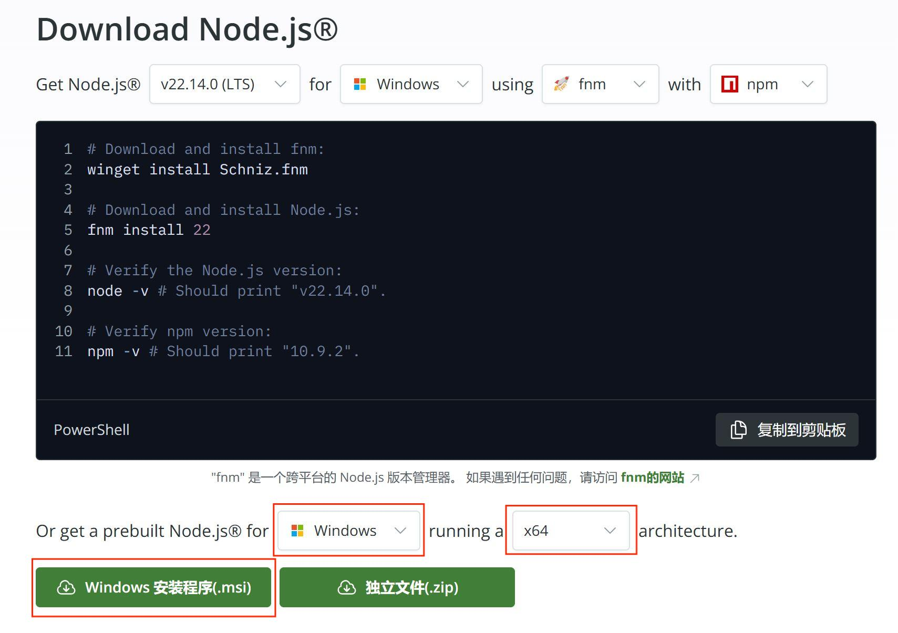
### 2.安装
跟着安装向导点下去即可

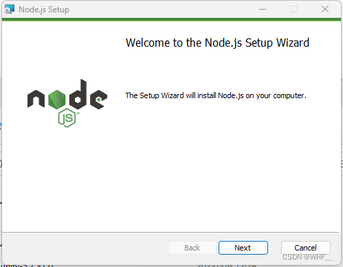

根据个人需求选择安装路径

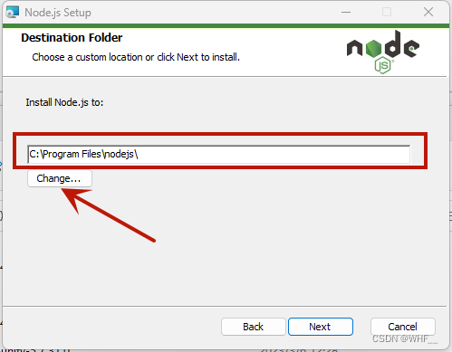

直接都选择默认安装

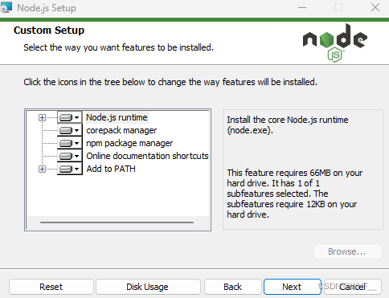

不选择自动安装必要工具

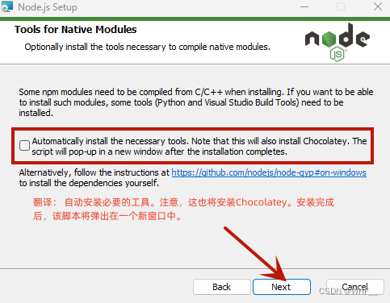

点击 Install 进行安装

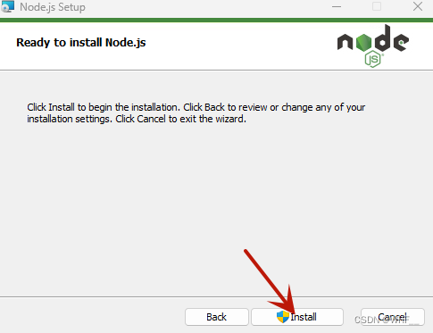

安装完毕后，测试是否安装成功，在 cmd 终端中输入
```
node -v
npm -v
```
若都能显示版本信息，说明 Node.js 安装成功
### 3.环境配置
（1）找到安装的目录，在安装目录下新建两个文件夹【node_global】和【node_cache】
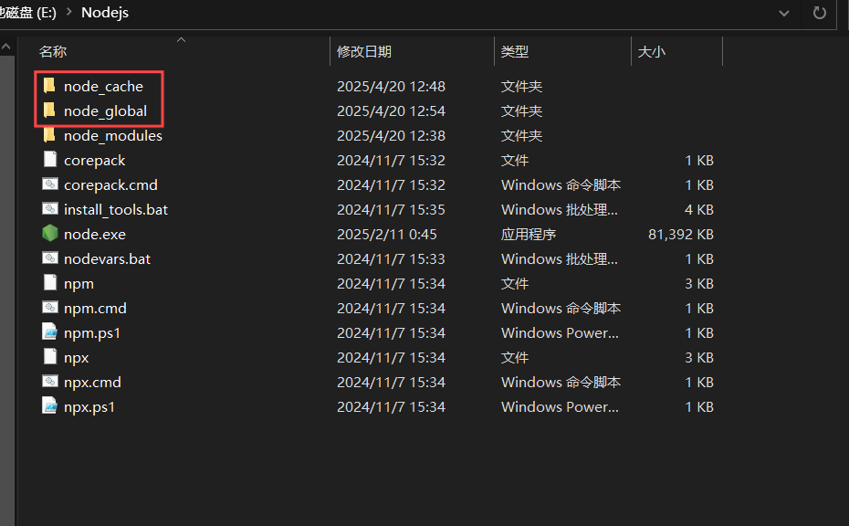

（2）创建完毕后，使用管理员身份打开 cmd 命令窗口，输入
```
npm config set prefix "你的路径\node_global" （复制你刚刚创建的"node_global"文件夹路径）
npm config set cache "你的路径\node_cache" （复制你刚刚创建的"node_cache"文件夹路径）
```
（3）配置环境变量
①【此电脑】-单击右键-【属性】-【高级系统设置】-【环境变量】
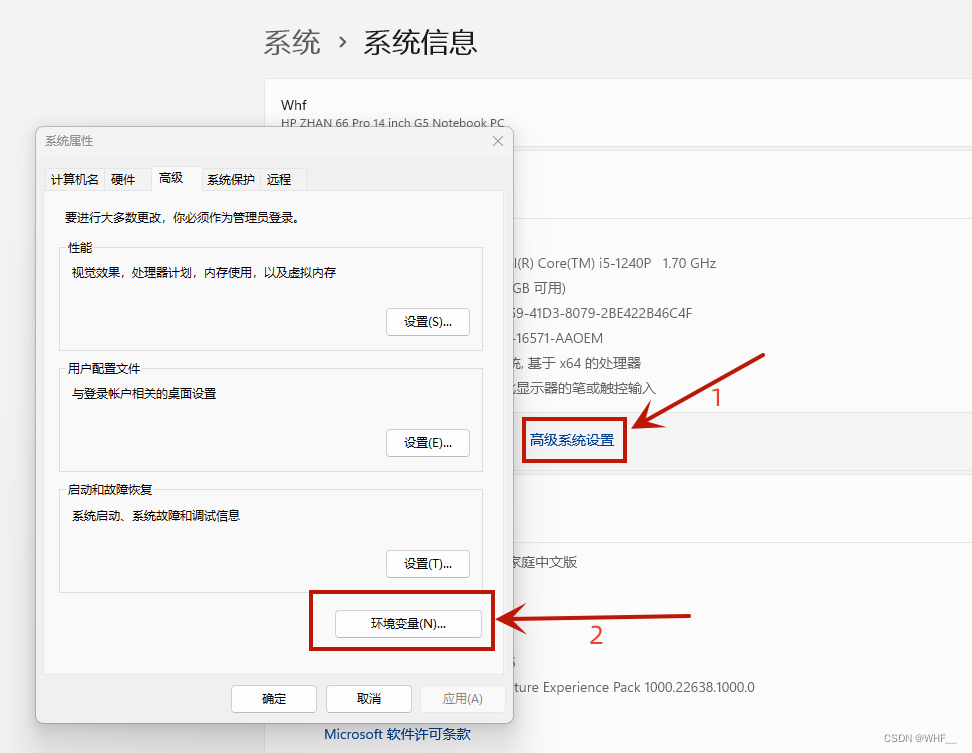

② 在【系统变量】中点击【新建】
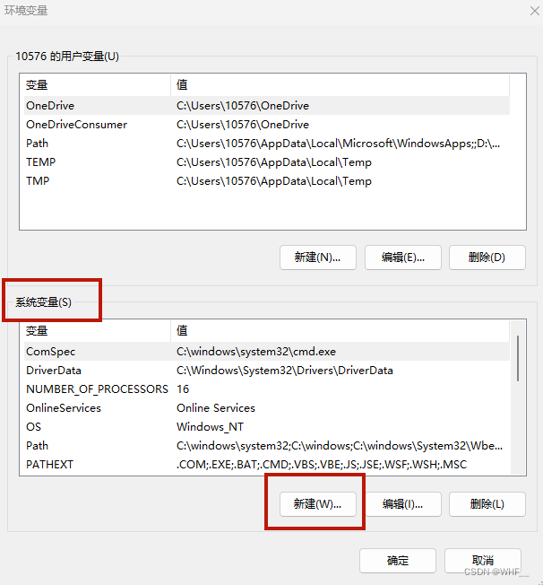
变量名：NODE_PATH
变量值：C:\Program Files\nodejs\node_global\node_modules
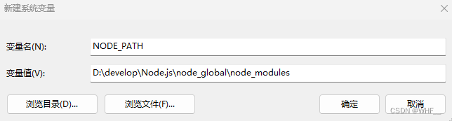
然后你就会发现【node_global】里多出了一个【node_modules】文件夹

Tips: 如果输入变量值之后没有自动创建【node_modules】文件夹，就在【node_global】下手动创建一个【node_modules】文件夹，再复制你创建的【node_modules】文件夹的路径地址到变量值

③编辑【用户变量】中的【Path】
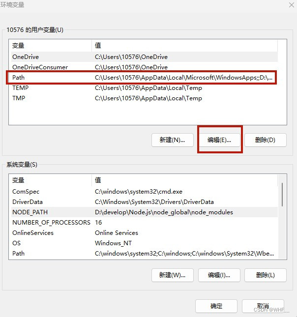

④将默认的 C 盘下【 AppData\Roaming\npm 】修改成 【node_global】的路径，点击确定
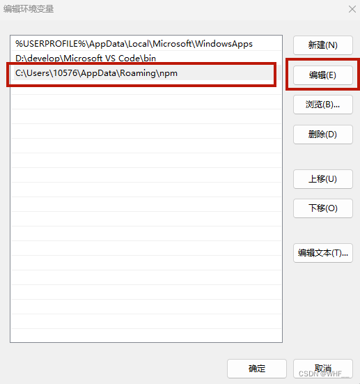
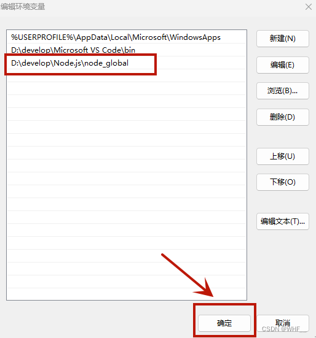

⑤在【系统变量】中选择【Path】点击【编辑】添加【NODE_PATH】，随后一直点击【确定】
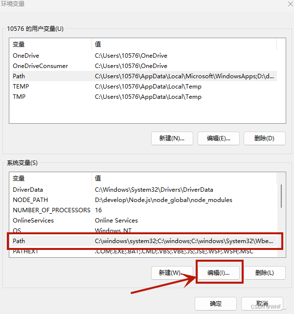
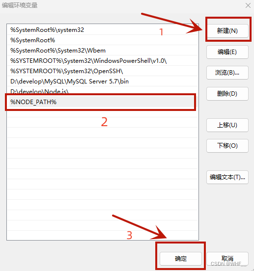

### 4.测试
输入：
```
npm install express -g   // -g代表全局安装
```
若出现以下结果即为配置成功
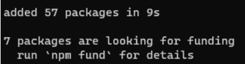

## 四、添加文件系统 MCP 服务器
以 Windows 系统为例，进入 Claude for Desktop ，点击左上角，找到 Settings 并进入，再进入 Developer 一栏，点击 Edit Config
随后会跳至一个包含 claude_desktop_config.json 文件的文件夹，进入该文件，将文件内容替换为：
```
{
  "mcpServers": {
    "filesystem": {
      "command": "npx",
      "args": [
        "-y",
        "@modelcontextprotocol/server-filesystem",
        "C:\\Users\\username\\Desktop",
        "C:\\Users\\username\\Downloads"
      ]
    }
  }
}
```
确保 "C:\\Users\\username\\Desktop", "C:\\Users\\username\\Downloads" 为您希望 Claude 能够访问和修改的有效目录。它已设置为适用于桌面和下载两个路径，但您也可以添加更多路径。
## 五、重启 Claude 并运行
更新完配置文件后，重新启动 Claude for Desktop
等待一会后，您应该会看到在输入框的下方看到一个锤子图标
接下来您可以通过 Claude for Desktop 对您的文件进行修改啦，只需在对话框中输入您想进行的操作，Claude 会在征求您的同意后自动对您设定的路径下的文件进行对应的更改操作